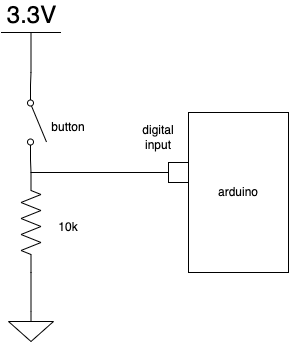
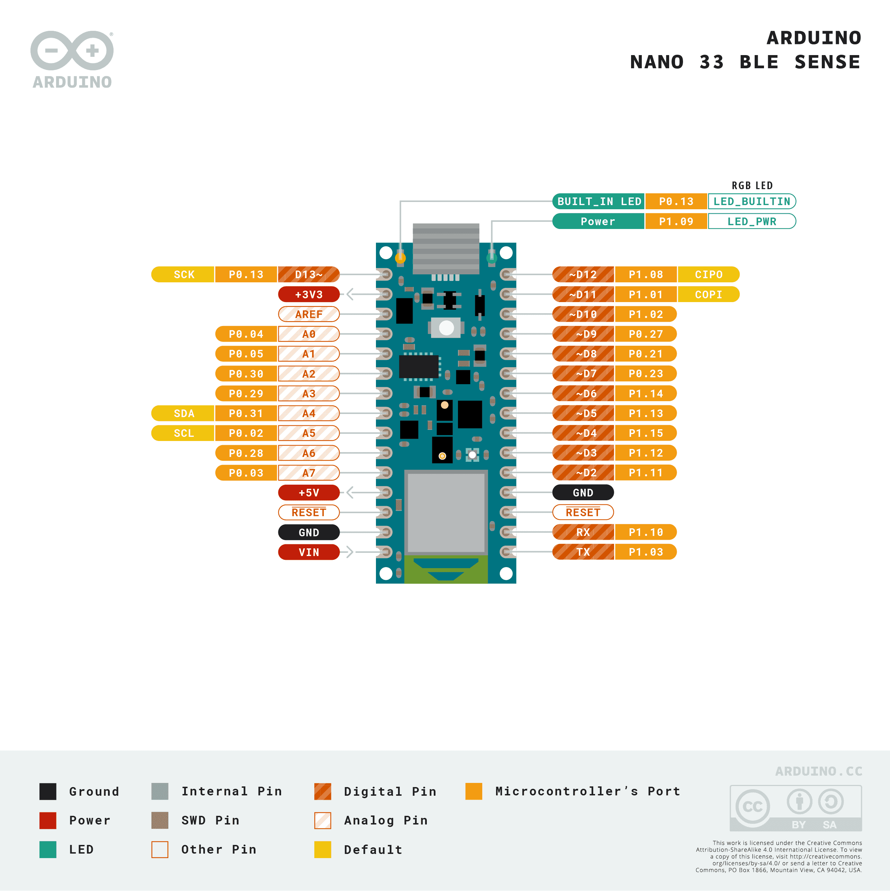
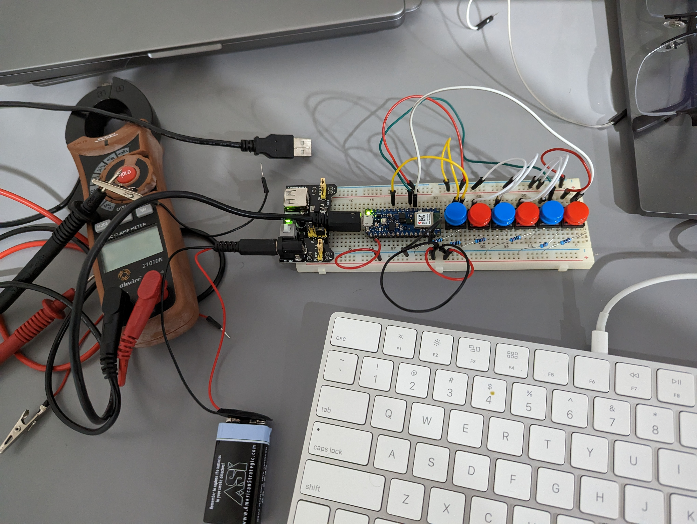

# VSCode HID keyboard shortcut over USB using Arduino Nano 33 

## Code
[source code](keyboard_6shortcuts.io)
- setup() initialize the input and serial ports for debugging.
- loop() enables checking each shortcut incrementally.

## Electronic
Each button can be connected as regular input.

Remember that the digital IO is located on the right side of the Arduino Nano 33 from D2 to D12.
where D2 is the pin 2 that must be configured as INPUT in the `setup()` function.

## Conclusion
The final build looks like this:
